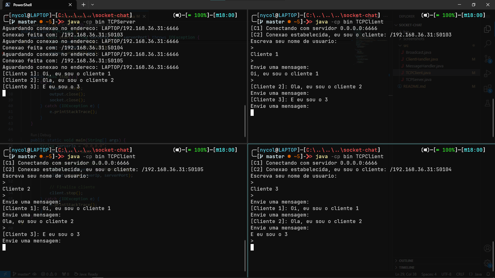

# Atividade prática: Chat com sockets

Atividade realizada para a disciplina de Sistemas Distribuídos, que consiste em modificar um código fornecido pelo professor para desenvolver um bate-papo em linha de comando, utilizando sockets TCP.

## Pré-requisitos

- `git`
- Java 8+ (JDK)

## Uso
Clone este repositório, usando o comando do git:

`git clone https://github.com/NycolasKCN/atividade-sd`

Entre no diretório criado:

`cd atividade-sd`

Para executar o servidor utilize o comando:

`java -cp bin TCPServer`

E para executar o cliente utilize o comando:

`java -cp bin TCPClient`

## Screenshot

## Referência

 - [Código fornecido pelo professor](https://github.com/marcuswac/sd-ufpb/tree/main/labs/lab-sockets)

## Autores

- [@NycolasKCN](https://www.github.com/NycolasKCN)
- [@marcuswac](https://www.github.com/marcuswac)

